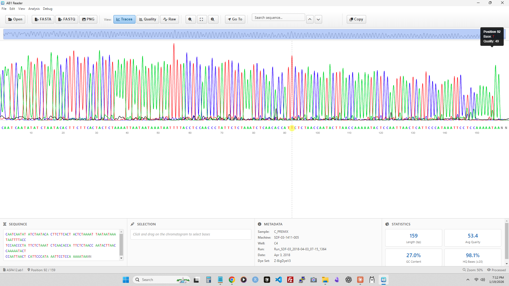

# AB1Reader

A modern, cross-platform desktop application for viewing and analyzing Sanger sequencing chromatogram data from AB1/ABIF files.


*Screenshot of ab1reader*

## Features

- **ABIF File Parsing** — Full support for the Applied Biosystems ABIF binary format
- **Interactive Chromatogram Visualization** — View the four nucleotide traces (A, T, G, C) with standard coloring
- **Minimap Navigation** — Quickly navigate large sequences with an interactive overview
- **Drag Selection** — Select regions of interest by clicking and dragging on the chromatogram
- **Quality Trimming** — Trim low-quality regions from the ends of sequences based on Phred quality scores
- **Multiple Export Formats** — Export sequences and visualizations in FASTA, FASTQ, or PNG formats
- **Quality Metrics** — View per-base quality scores and overall sequence statistics

## Installation

### Download

Download the latest release for your platform from the [Releases](https://github.com/maypop-labs/ab1reader/releases) page:

- **Windows** — `AB1Reader-x.x.x.exe` (portable) or `AB1Reader-Setup-x.x.x.exe` (installer)
- **macOS** — `AB1Reader-x.x.x.dmg`
- **Linux** — `AB1Reader-x.x.x.AppImage`

### Windows Note

Since the application is not code-signed, Windows may display a SmartScreen warning. Click "More info" → "Run anyway" to proceed.

## Usage

1. Launch AB1Reader
2. Open an AB1 file via **File → Open** or drag and drop a file onto the window
3. Use the chromatogram viewer to examine your sequence:
   - Scroll or use the minimap to navigate
   - Click and drag to select regions
   - Use the toolbar to zoom in/out
4. Apply quality trimming if needed via **Edit → Trim Low Quality**
5. Export your data via **File → Export** in your preferred format

## Building from Source

### Prerequisites

- [Node.js](https://nodejs.org/) (v16 or higher)
- npm (included with Node.js)

### Steps

```bash
# Clone the repository
git clone https://github.com/maypop-labs/ab1reader.git
cd ab1reader

# Install dependencies
npm install

# Run in development mode
npm start

# Build for your platform
npm run build

# Or build for a specific platform
npm run build:win    # Windows
npm run build:mac    # macOS
npm run build:linux  # Linux
```

Build output will be in the `dist/` folder.

## Supported File Formats

### Input
- `.ab1` — Applied Biosystems genetic analysis data file (ABIF format)

### Export
- **FASTA** (`.fasta`, `.fa`) — Sequence only
- **FASTQ** (`.fastq`, `.fq`) — Sequence with quality scores
- **PNG** (`.png`) — Chromatogram image

## About AB1 Files

AB1 files are binary files produced by Applied Biosystems DNA sequencers (such as the 3730 and SeqStudio systems). They contain:

- Raw and processed electropherogram trace data
- Base calls and quality scores (Phred format)
- Sequencing metadata (sample name, run date, instrument info, etc.)

AB1Reader parses the complete ABIF directory structure, giving you access to all embedded data.

## Technology

Built with:
- [Electron](https://www.electronjs.org/) — Cross-platform desktop framework
- Vanilla JavaScript — No frontend framework dependencies
- HTML5 Canvas — High-performance chromatogram rendering

## License

[MIT License](LICENSE)

## Acknowledgments

- Applied Biosystems for the [ABIF file format specification](https://www.thermofisher.com/document-connect/document-connect.html?url=https://assets.thermofisher.com/TFS-Assets/LSG/manuals/cms_040979.pdf)
- The bioinformatics community for feedback and testing

---

**Questions or issues?** Open an issue on the [GitHub repository](https://github.com/maypop-labs/ab1reader/issues).
